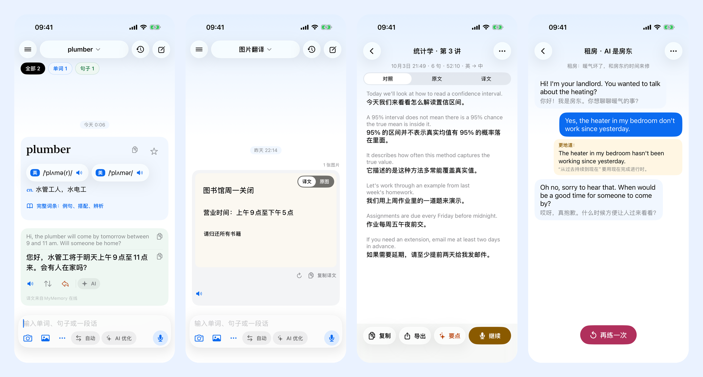
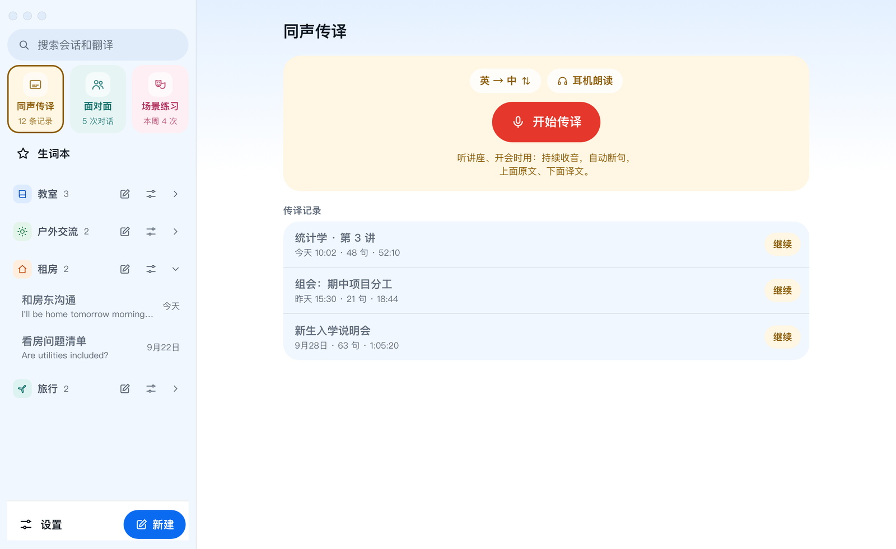

# Q-Translator 快译

[English](README.md) | **简体中文** | [User guide](docs/USER_GUIDE.md) | [使用说明](docs/USER_GUIDE.zh-CN.md)

快译是一个简单、直接、高效的中英词典和翻译工具，支持 iPhone、iPad、Mac 和安卓。打开就能输入，单词、句子、整段话都能翻译。它还能拍照翻译、给讲座做同声传译、帮两个人面对面对话，以及让 AI 扮演角色陪你练英语口语。

快译免费、开源。能在本机完成的都在本机完成，没有自己的服务器。AI 功能是可选的，用你自己的 API Key。



## 功能

### 翻译
- **查单词**：英式、美式音标和真人发音，按词性汇总的释义，逐条释义和例句（常用的在前），常用搭配、同根词、近义词辨析和词源。
- **句子和段落**：下载离线模型后用系统本机翻译（安卓用 Google ML Kit），不用联网；没有离线模型时走在线翻译。
- **拍照和图片翻译**：拍照，或从相册一次选多张。文字在本机识别，译文直接盖在原文的位置上。点一下切换译文和原图；旋转图片不用重新识别；识别不好的单张可以重新识别。
- **语音输入**：点麦克风说英语或中文，边说边出文字。在本机识别，录音只保存在本机。
- **会话和场景**：每次翻译都保存在会话里，会话可以按场景分组（教室、租房、旅行……）。可以搜索，按单词、句子、图片筛选，也能从输入记录跳回任意一条。
- **生词本**：点星标收藏单词，场景练习里学到的新说法也能一键加入。

### 场景模块
- **同声传译**：听讲座、开会时用。持续收音，自动断句，边说边显示双语字幕。离开页面、锁屏也继续，还可以用耳机朗读译文。每段传译存成一条记录：讲座中间休息后可以接着录，可以导出，也可以让 AI 总结要点。
- **面对面对话**：手机平放在桌上，上半屏倒过来给对方看。各自按自己的按钮说话，自动翻译，大字显示并朗读出来。
- **英语场景练习**（需要 AI）：AI 扮演房东、服务员、面试官，或者你自己描述的任何角色，你用英语说或打字回答。“语音聊天”模式会自动开始听，说完停一下就发送，像打电话一样。说得不地道的句子下面会给出更地道的说法和原因，不打断对话；结束时有小结，新说法可以加入生词本。

### 朗读
- 8 个精选的系统音色（免费、离线），以及 6 个更像真人的 AI 音色（需要 ChatGPT 的 Key）。点一下就能试听。
- 全局朗读速度：AI 音色、系统音色和单词真人发音都按这个速度。

### AI（可选，用你自己的 Key）
- 优化机器翻译的译文，可以每句自动优化，也可以点一下才优化。
- 帮你写回复：刚翻译的消息，可以写成短信或邮件回复，你说要点由 AI 来写，或者你写草稿由 AI 优化。
- 总结同声传译的要点，驱动场景练习，按你的要求翻译图片（例如“只翻译菜名”）。
- 支持 Claude、ChatGPT（OpenAI）、DeepSeek，以及任何兼容 OpenAI 接口的服务（通义千问、Kimi、智谱等）。怎么注册和填写见[使用说明里的 API Key 一节](docs/USER_GUIDE.zh-CN.md#5-ai-功能和-api-key)。

### 各平台特有
- **iPhone**：长按 App 图标有快捷操作：同声传译、面对面对话、场景练习、新建翻译。
- **Mac**：全局快捷键：`⌥D` 主窗口、`⌥F` 翻译任意 App 里选中的文字、`⌥R` 翻译并替换、`⌥V` 翻译剪贴板、`⌥S` 截图翻译、`⌥A` 快速输入。还有右键菜单的“服务”翻译、`⌘V` 粘贴图片，以及“功能”菜单（`⇧⌘I` 同声传译、`⇧⌘F` 面对面、`⇧⌘P` 场景练习）。
- **安卓**：可以把文字或图片“分享”给快译，也可以在任意 App 选中文字后，从菜单里选“快译”。

<p align="center"></p>

## 平台进度

| 平台 | 状态 |
| --- | --- |
| iPhone | 全部功能（`apple/`，iOS 26 及以上） |
| Mac | 全部功能（`apple/`，macOS 26 及以上） |
| iPad | 使用 iPhone 版，宽屏布局；最新的语音、同声传译、面对面、场景练习还在打磨 |
| 安卓手机和平板 | 查词、句子、图片和 AI 功能（`android/`，Android 8 及以上）；语音和场景模块即将推出 |

## 翻译来源

快译优先用免费和离线的来源，必须时才联网。

| 来源 | 用于 | 说明 |
| --- | --- | --- |
| Apple Translation 框架 | 句子、段落、同声传译 | 本机翻译，免费，下载语言模型后可离线使用 |
| Apple Speech | 语音输入、同声传译 | 支持时在本机识别，录音不上传 |
| Apple Vision | 图片里的文字 | 本机识别，图片不上传 |
| Google ML Kit（安卓） | 句子翻译和文字识别 | 本机运行，中文模型（约 30 MB）只需下载一次 |
| 有道词典 JSON 接口 | 单词词条和单词发音 | 公开但非官方的接口，随时可能变化 |
| MyMemory | 句子翻译的备用来源 | 免费额度，每天有上限 |

快译和以上服务商都没有关联。

## 隐私

- 你翻译的文字、图片和录音都留在本机，只有翻译来源或 AI 服务商需要的内容会发出去：在线翻译的请求，或者发给你自己 AI 服务商的文字。
- API Key 保存在系统钥匙串里（安卓用 Android Keystore 加密），只会发给你选择的服务商。
- App Store 版本可以通过[友盟+](https://www.umeng.com/)发送匿名使用统计（只统计用了哪些功能），第一次打开时征得你同意后才会发送，随时可以在设置里关闭。从源码编译的版本不含统计 Key，什么都不发。

## 从源码编译

需要 Xcode 26 及以上和 [XcodeGen](https://github.com/yonaskolb/XcodeGen)（`brew install xcodegen`）。Xcode 工程由 `apple/project.yml` 生成，不放进仓库。

### Mac

```bash
cd apple
./build.sh install
```

编译出 `Q-Translator.app` 并复制到“应用程序”文件夹。钥匙串里有“Apple Development”证书时，`build.sh` 会用它签名（也可以用 `QTRANSLATOR_SIGN_IDENTITY` 指定）。全局快捷键用到的“辅助功能”和“屏幕录制”权限跟签名绑定，证书固定的话只需要授权一次。

打安装包：`./make_dmg.sh` 生成 `dist/Q-Translator-<版本>.dmg`。要发给别人用，需要“Developer ID Application”证书，并用 `xcrun notarytool store-credentials QTranslator --apple-id <Apple ID> --team-id <团队 ID>` 保存公证凭据。

### iPhone / iPad

```bash
cd apple
./Scripts/fetch_umeng.sh
QTRANSLATOR_TEAM_ID=你的团队ID xcodegen generate
open QTranslator.xcodeproj
```

选择 `QTranslator-iOS` 运行即可。`fetch_umeng.sh` 把统计 SDK 下载到 `apple/Vendor/`（不放进仓库）。`QTRANSLATOR_TEAM_ID` 是你的 Apple 开发者团队 ID，只有装到真机时才需要。iOS 模拟器里不能用系统本机翻译，句子会改走在线翻译。

想用自己的友盟统计，把 Key 写在 `apple/Config/Local.xcconfig`（git 会忽略它）；自定义事件列表在 `apple/Config/umeng-events.csv`：

```
UMENG_APPKEY_IPHONE = ...
UMENG_APPKEY_IPAD = ...
UMENG_APPKEY_MAC = ...
```

### 安卓

需要 JDK 17（Android Studio 自带的就行）和 Android SDK。

```bash
cd android
./gradlew assembleRelease
```

APK 在 `android/app/build/outputs/apk/release/`，每种 CPU 一个（现在的手机基本都是 `arm64-v8a`）。Release 版用调试证书签名，可以直接安装；上架应用商店前要换成你自己的签名。

## 目录结构

```
apple/
  project.yml          XcodeGen 配置（QTranslator-iOS 和 QTranslator-macOS 两个 target）
  Shared/              所有 Apple 平台共用的代码
    Core/              词典、翻译、识字、朗读、语音输入、同声传译
    AI/                服务商设置、接口、提示词、用量
    Conversation/      会话、场景、存储和界面
    Modules/           同声传译、面对面、场景练习的记录
    Views/             设置等界面
    Support/           主题、统计、平台工具
  iOS/                 iOS 入口、输入栏、相机、快捷操作
  macOS/               Mac 入口、菜单栏、快捷键、服务
  Config/              统计配置（Key 只留在本机）
  Scripts/             图标生成、SDK 下载
android/
  app/src/main/java/com/yishulabs/qtranslator/
    core/              词典、翻译、识字、朗读、设置
    ai/                服务商设置、接口、提示词、用量
    conversation/      会话、场景、存储
    ui/                Jetpack Compose 界面
docs/                  使用说明和截图
```

## 参与贡献

欢迎提 Issue 和 Pull Request。请保持快译的简单：打开就能输入，优先免费和离线，AI 保持可选。

## 许可证

[MIT](LICENSE)
