# Q-Translator user guide

**English** | [简体中文](USER_GUIDE.zh-CN.md) · [Back to the project](../README.md)

This guide uses the iPhone app; the Mac and iPad apps work the same way. The app's interface is in Chinese, so Chinese button names are given in brackets. Mac hotkeys are in [section 7](#7-mac-hotkeys).

**Contents**

1. [Getting started](#1-getting-started)
2. [Translating words, sentences, speech and photos](#2-translating-words-sentences-speech-and-photos)
3. [Conversations, scenes and the word list](#3-conversations-scenes-and-the-word-list)
4. [The three scenario modules](#4-the-three-scenario-modules)
5. [AI features and API keys](#5-ai-features-and-api-keys)
6. [Reading aloud, voices and offline models](#6-reading-aloud-voices-and-offline-models)
7. [Mac hotkeys](#7-mac-hotkeys)
8. [FAQ](#8-faq)

---

## 1. Getting started

The app opens on a translation conversation. Type in the box at the bottom; there is no language to pick: English is translated into Chinese and Chinese into English.

On first launch the app shows its [privacy policy](PRIVACY.md); read and accept it to start using the app. You can read it again later in Settings › 关于 (About) › 隐私协议.

Everything except a few AI features works without an API key: dictionary, sentence and photo translation, voice input, reading aloud, live interpretation and face to face. Scene practice, AI polishing, reply drafting, AI voices and interpretation summaries need a key; see [section 5](#5-ai-features-and-api-keys).

## 2. Translating words, sentences, speech and photos

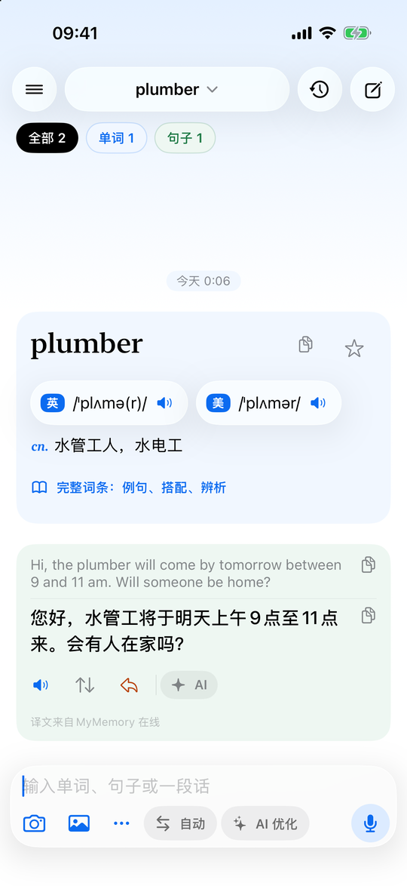

**The input bar**, left to right:

| Button | What it does |
| --- | --- |
| Camera | Take a photo to translate |
| Photos | Pick images from the library (several at once) |
| ··· | Pick an image file, or paste text or an image |
| 自动 (Auto) | Direction: auto / English → Chinese / Chinese → English |
| AI 优化 (AI polish) | Polish every sentence in this conversation with AI (needs a key) |
| Mic / Send | The microphone when the box is empty, Send when it is not |

**Words** appear as a dictionary card with UK and US phonetics (tap the speaker for real-person audio) and the main meanings. Tap 完整词条 (full entry) for every sense with examples, phrases, synonym notes and etymology; tap the star to keep the word.

**Sentences and paragraphs** appear in a green card with the original above and the translation below, each with a copy button. The buttons underneath:

- read the translation aloud;
- swap (translate the translation back);
- reply (let AI draft a reply as a text message or an email);
- AI (polish this sentence).

The source of the translation is shown at the bottom of the card.

 

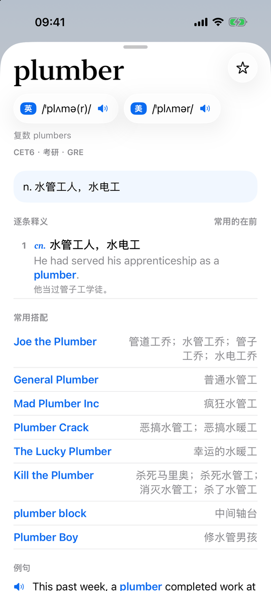

**Voice input**: with the box empty, tap the microphone and speak English or Chinese; the words appear as you talk. The language is shown at the bottom left; tap it to switch. Tap the red button when you are done: the text goes into the box so you can edit it before sending. Turn on Settings › 语音输入 › 说完自动翻译 to translate as soon as you stop.

 

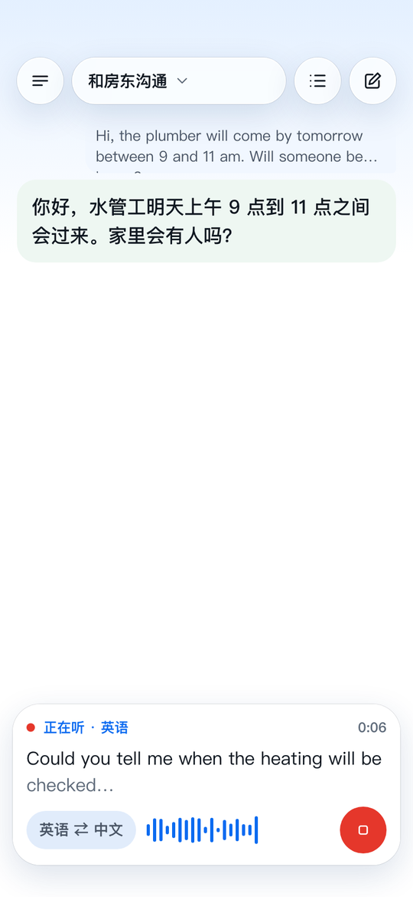
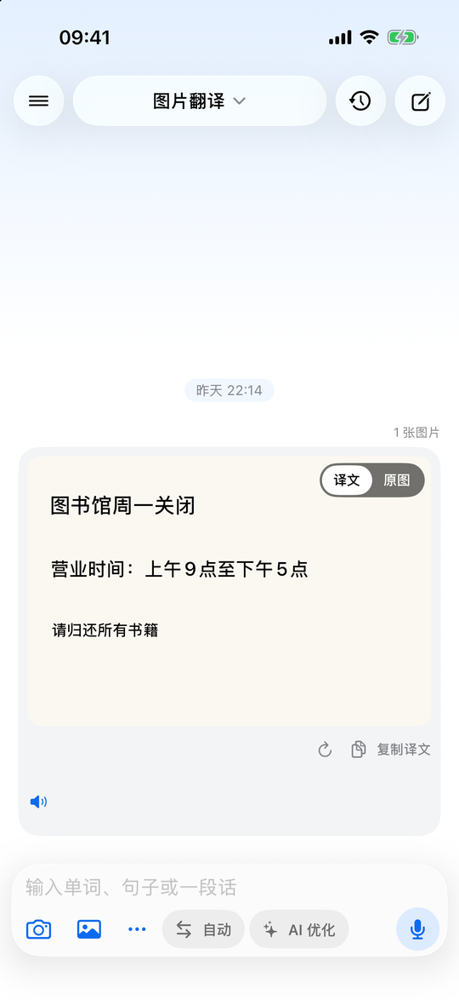
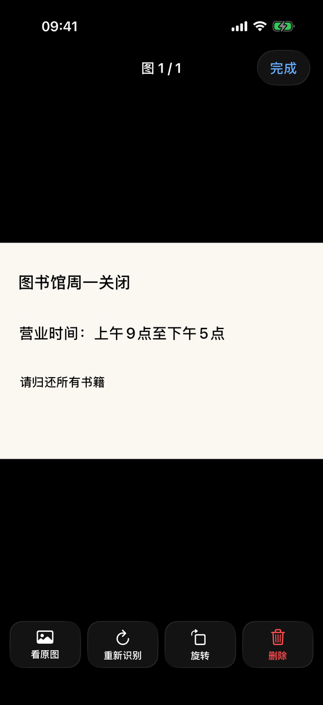

**Photo translation**

1. Tap the camera, or tap Photos and pick one or more images. They wait above the input box: tap one to preview it, long-press to reorder, tap × to remove it.
2. With AI polish on, you can type an instruction such as "only translate the dishes".
3. Tap Send. Text is recognised on the device and the translation is drawn over the original text, on the same background colour.
4. Use 译文 / 原图 at the top right to switch between the translation and the original. Tap the image for full screen, with four buttons:
   - **看原图** (show original);
   - **重新识别** (recognise again);
   - **旋转** (rotate; the translation turns with it, no re-recognition);
   - **删除** (delete; you are asked to confirm).

## 3. Conversations, scenes and the word list

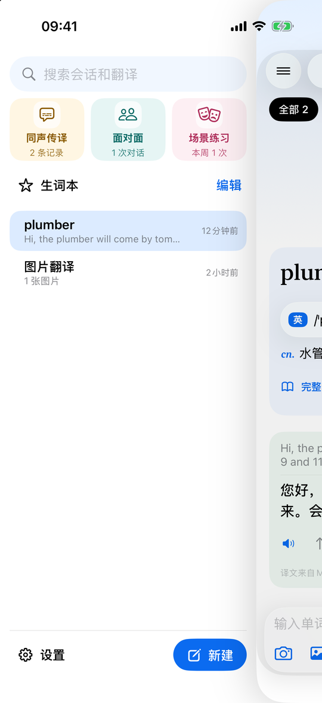

Tap ☰ at the top left (or swipe right from the left edge) to open the drawer:

- **Search** across all conversations.
- **The three modules**: live interpretation, face to face and scene practice ([section 4](#4-the-three-scenario-modules)).
- **生词本 (word list)**: the words you starred.
- **Conversations, grouped by scene.**
  - **Organise**: long-press a conversation to drag it into another scene, swipe left to delete it, or tap 编辑 (edit) to reorder, rename or delete scenes.
  - **New**: tap 新建 (new) to start a conversation and choose its scene; you can create a new scene there as well.

Inside a conversation:

- tap its name to rename it or move it;
- the clock button at the top right lists everything you typed; tap one to jump to it;
- 全部 / 单词 / 句子 / 图片 filter by type;
- the ↓ button takes you back to the newest item;
- swipe left on any item to delete it.

 

## 4. The three scenario modules

### Live interpretation (同声传译)

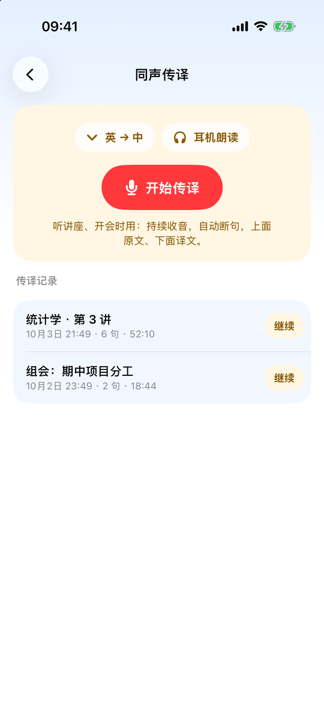
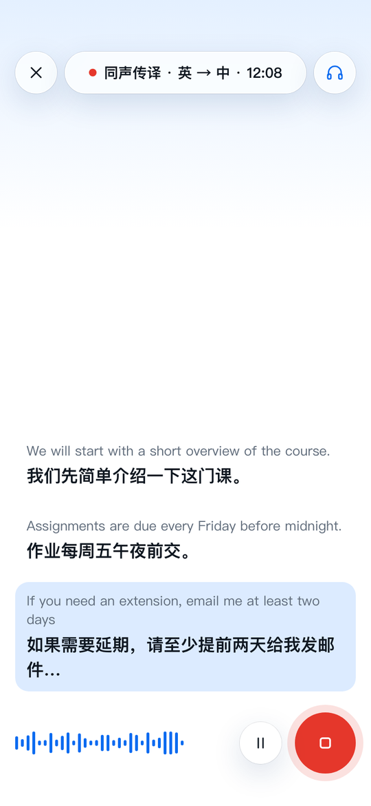
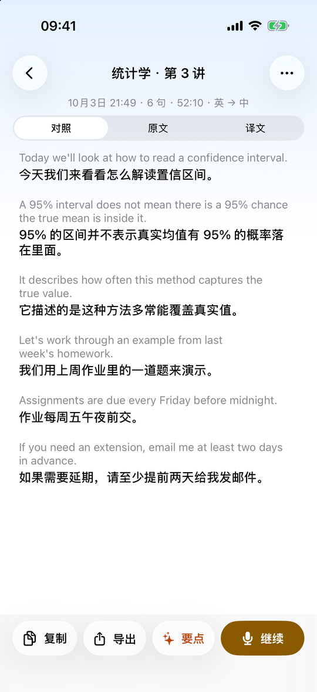

For lectures and meetings.

1. Drawer › 同声传译. Choose which language to listen to, turn on 耳机朗读 if you want the translation read into your earphones, and tap 开始传译 (start).
2. Speech is split into sentences and shown as bilingual subtitles: the original in small type, the translation below it. The sentence being spoken is highlighted and translated as it grows. Switch between bilingual, original only and translation only at the top.
3. To change language mid-way, tap the title (同声传译 · 英 → 中 ▾) and pick the other language from the menu. Earlier subtitles are kept.
4. **Background**: tap ⌄ at the top left to collapse the page; interpretation keeps running. A bar above the input box shows it is running; tap it to go back. It also keeps listening, translating and reading aloud when you go to the Home Screen or lock the phone.
5. Tap the red stop button to finish. The subtitles are saved as a record.
6. In the record list:
   - tap 继续 (continue) to add to a record, for example after a lecture break;
   - tap a record to read it, copy it, export it, or get an AI summary (要点);
   - use ··· to rename or delete it.

Tip: download the English and Chinese models in Settings › 离线翻译和语音识别模型 for faster, offline interpretation.

### Face to face (面对面)

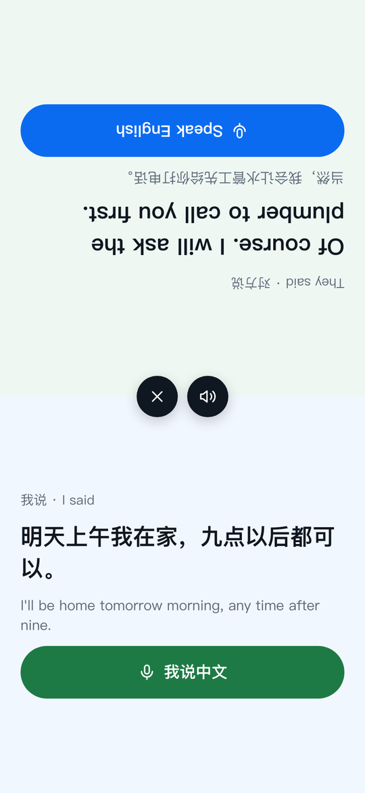

1. Drawer › 面对面 › 开始对话.
2. Put the phone flat on the table. The top half is upside down for the person opposite.
3. Whoever speaks taps the big button on their half, and taps again when done. The translation is shown in large type and read aloud.
4. The speaker button in the middle turns reading on or off; × ends the conversation and saves it as a record.

 

### English scene practice (场景练习, needs AI)

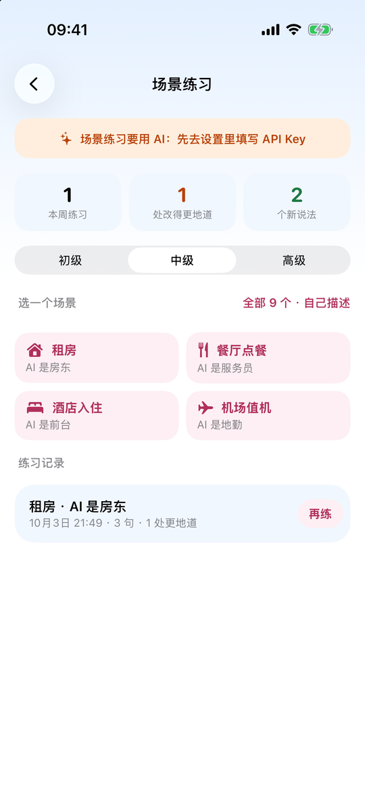
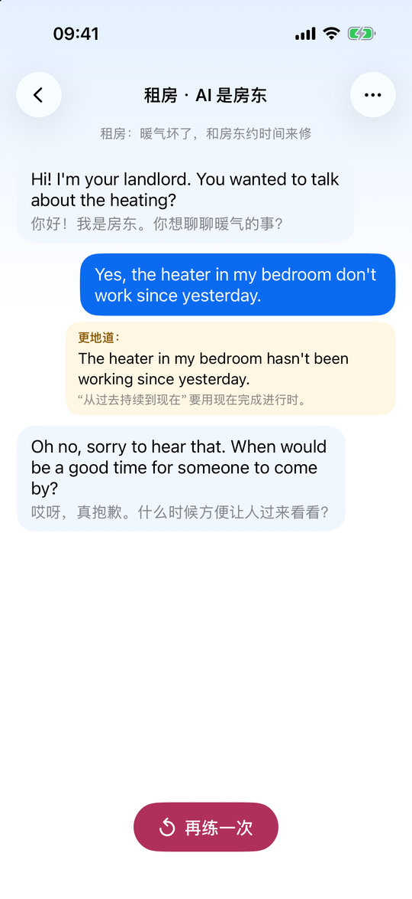

1. Drawer › 场景练习. Set up an API key first ([section 5](#5-ai-features-and-api-keys)).
2. Choose a level (beginner / intermediate / advanced) and a scene. 全部 9 个 shows all scenes, and you can also describe your own, for example "chatting with a barista".
3. The AI plays the other side and speaks first. You can:
   - answer by voice or text; Chinese is fine where you are stuck;
   - tap the waveform button to switch to **voice chat**: it starts listening when the partner finishes and sends when you pause;
   - tap 字 to show the Chinese meaning of every line, and the speaker button to toggle reading aloud or change the speed.
4. If a sentence of yours is unnatural, a yellow "more natural" (更地道) note appears under it with the reason.
5. Tap × to finish and see a summary: how many sentences, how many corrections, and new phrases you can add to the word list.
6. The module page shows this week's progress, and old sessions can be reviewed or practised again.

On iPhone, long-press the app icon to jump straight into interpretation, face to face, practice or a new translation.

## 5. AI features and API keys

### Why your own key

Q-Translator has no AI credit and no server of its own. You create an account with an AI provider, add credit, and get an **API key** (a secret string such as `sk-…`). Paste it into the app, and the app talks to the provider directly from your device. The provider bills you for what you use.

- The key is stored only in the system Keychain on your device.
- **A ChatGPT Plus or Claude Pro subscription does not include API credit**; the API is paid for separately on the developer platform.
- Costs are usually tiny: polishing a sentence or one round of practice typically costs a fraction of a cent. Settings shows your total usage and an estimated cost.

### What needs AI

| Feature | Provider |
| --- | --- |
| AI polish, reply drafting, photo instructions | Any |
| English scene practice | Any |
| Interpretation summaries | Any |
| AI voices (most natural reading) | OpenAI (ChatGPT) key only |

### Which provider

| Provider | Good for | Sign up |
| --- | --- | --- |
| **Claude (Anthropic)** | High-quality translation and writing | <https://platform.claude.com/> |
| **ChatGPT (OpenAI)** | Also unlocks the AI voices | <https://platform.openai.com/api-keys> |
| **DeepSeek** | Low price, strong Chinese, pay with Alipay or WeChat | <https://platform.deepseek.com/> |
| **Custom** | Any OpenAI-compatible service (Qwen, Kimi, GLM…) | see below |

Anthropic and OpenAI are not available in every region; check that yours is supported.

### Getting a Claude key

1. Go to <https://platform.claude.com/> and sign up or log in.
2. Add credit under Billing.
3. Under API Keys, click Create Key and give it a name.
4. Copy the key (starts with `sk-ant-`). It is shown only once.

### Getting an OpenAI key

1. Go to <https://platform.openai.com/> and sign up or log in (your ChatGPT account works).
2. Add a payment method and credit under Settings › Billing.
3. Open <https://platform.openai.com/api-keys> and click Create new secret key.
4. Copy the key (starts with `sk-`). It is shown only once.

### Getting a DeepSeek key

1. Go to <https://platform.deepseek.com/> and sign up.
2. Top up under 充值 (Alipay and WeChat Pay are accepted).
3. Under API keys, click 创建 API key.
4. Copy the key (starts with `sk-`). It is shown only once.

### Other OpenAI-compatible services

Choose 自定义 (Custom) as the provider and fill in the key, the base URL and the model name. Common base URLs:

| Service | Base URL | Get a key |
| --- | --- | --- |
| Qwen (Alibaba Cloud Model Studio) | `https://dashscope.aliyuncs.com/compatible-mode/v1` | <https://bailian.console.aliyun.com/> |
| Kimi (Moonshot AI) | `https://api.moonshot.cn/v1` | <https://platform.moonshot.cn/> |
| GLM (Zhipu) | `https://open.bigmodel.cn/api/paas/v4` | <https://open.bigmodel.cn/> |

Find the model name in the provider's documentation (for example `qwen-plus`); model names change over time.

### Entering the key in the app

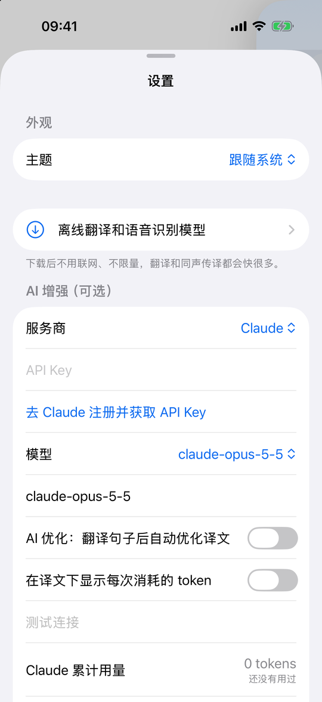
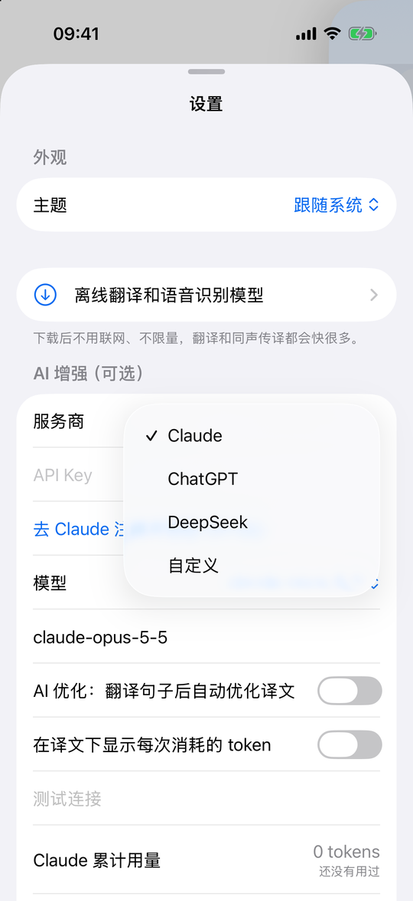

1. Drawer › 设置 (Settings) at the bottom left › AI 增强（可选）.
2. **服务商 (Provider)**: choose the one you signed up with.
3. **API Key**: paste your key. The link below it opens the provider's sign-up page.
4. **模型 (Model)**: pick one from the list or type a name. The default is fine; smaller models near the top of the list cost less.
5. Tap **测试连接 (Test connection)**. 连接正常 means it works.
6. Optionally turn on automatic AI polishing for every sentence. When it is off, AI runs only when you tap the AI button under a sentence.
7. Usage and estimated cost per day are in 累计用量 and 用量报表 (usage report).

Each provider's key is stored separately, so switching providers does not lose a key.

**Security**: never share your key or a screenshot of it. If it may have leaked, delete it in the provider's console and create a new one. Most providers let you set a monthly spending limit.

## 6. Reading aloud, voices and offline models

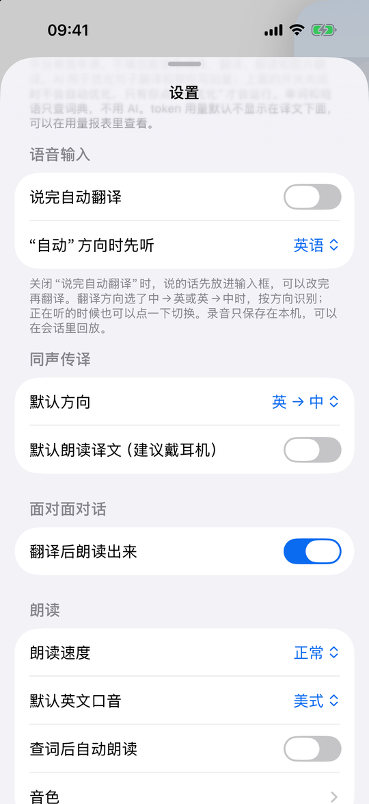
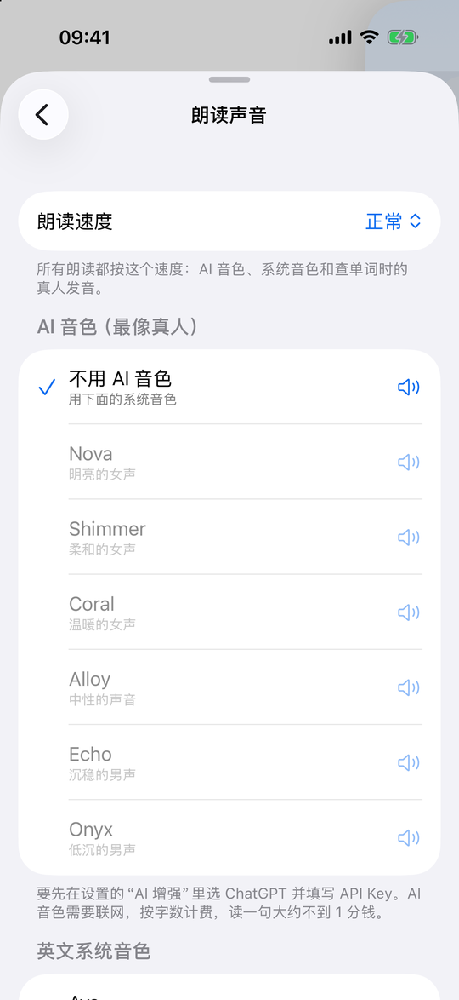

- **Speed** (朗读速度): applies to all reading: AI voices, system voices and word audio.
- **English accent** (默认英文口音): UK or US word audio.
- **Voices** (音色): tap one to hear a sample.
  - **AI voices** sound the most natural, need an OpenAI key and are billed per character (well under a cent per sentence).
  - **System voices** are free and offline. For voices marked 需下载 (download), tap the button below the list and go to Accessibility › Spoken Content › Voices; the Premium or Enhanced versions sound best.
- **Offline models** (离线翻译和语音识别模型): download the English and Chinese translation and speech models so translation, interpretation and face to face work offline and much faster.
- **Appearance** (外观): follow the system, light or dark.

## 7. Mac hotkeys

The Mac app adds a menu bar icon. These hotkeys work in any app:

| Hotkey | Action |
| --- | --- |
| `⌥D` | Show or hide the main window |
| `⌥F` | Translate the selected text |
| `⌥R` | Translate the selected text and replace it with the translation |
| `⌥V` | Translate the clipboard |
| `⌥S` | Translate a screenshot of an area you select |
| `⌥A` | Quick input box |
| `⇧⌘S` | Voice input in the main window |
| `⇧⌘I` / `⇧⌘F` / `⇧⌘P` | Open interpretation / face to face / practice (hold `⌥` to start right away) |
| `⌘V` | Paste an image to translate; you can also drop images on the window |

The first time you use `⌥F`, `⌥R` or `⌥S`, macOS asks you to allow Accessibility and Screen Recording for Q-Translator in System Settings › Privacy & Security. You can also select text in any app, right-click, and choose Q-Translator from the Services menu.

## 8. FAQ

**Sentences say "MyMemory online" instead of on-device translation.**
The on-device model has not been downloaded. Download English and Chinese in Settings › 离线翻译和语音识别模型. (The iOS Simulator cannot translate on device.)

**The AI connection test fails.**
- Check that the key was copied completely, with no spaces.
- Check that your account has credit.
- With Custom, check the base URL and model name.
- Make sure the provider is available in your region.

**Interpretation hears nothing.**
Allow microphone and speech recognition for Q-Translator in the system Settings. With Bluetooth earphones, the phone's own microphone listens and the earphones only play the translation.

**Where is my data?**
On your device only: conversations, photos, recordings and records. Deleting the app deletes them.

Questions and suggestions are welcome in [GitHub Issues](https://github.com/aquila0625/Q-Translator/issues).
