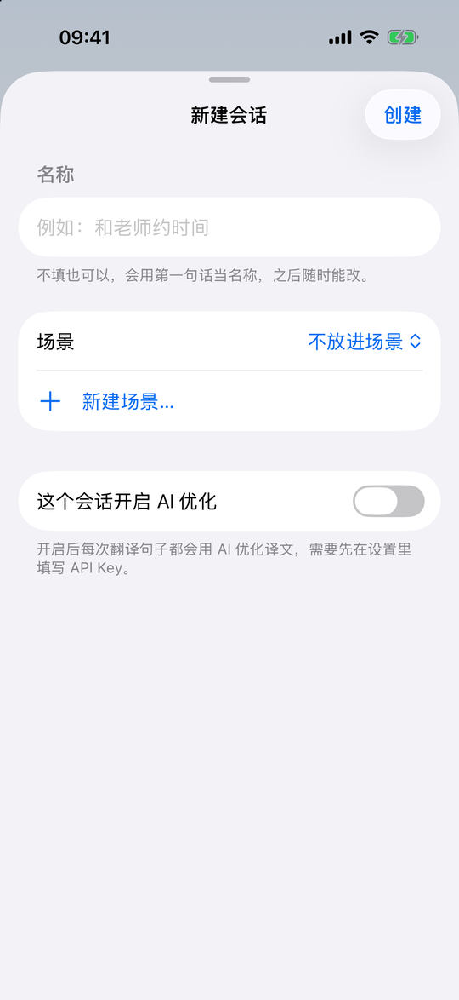

# 快译 使用说明

[English](USER_GUIDE.md) | **简体中文** · [返回项目首页](../README.zh-CN.md)

这份说明以 iPhone 为例，Mac 和 iPad 的操作基本一样。Mac 特有的快捷键见[第 7 节](#7-mac-的快捷键)。

**目录**

1. [开始使用](#1-开始使用)
2. [翻译：单词、句子、语音和图片](#2-翻译单词句子语音和图片)
3. [会话、场景和生词本](#3-会话场景和生词本)
4. [三个场景模块](#4-三个场景模块)
5. [AI 功能和 API Key](#5-ai-功能和-api-key)
6. [朗读、音色和离线模型](#6-朗读音色和离线模型)
7. [Mac 的快捷键](#7-mac-的快捷键)
8. [常见问题](#8-常见问题)

---

## 1. 开始使用

打开快译，就是一个翻译会话，直接在下面的输入框里输入就行，不用先选语言：输入英文翻成中文，输入中文翻成英文。

隐私协议在“设置 → 关于 → 隐私协议”里，详见[隐私协议](PRIVACY.zh-CN.md)。

不填任何 API Key 也能用：查词、句子翻译、拍照翻译、语音输入、朗读、同声传译和面对面对话都不需要 AI。只有场景练习、AI 优化、写回复、AI 音色和传译要点要用 AI，见[第 5 节](#5-ai-功能和-api-key)。

## 2. 翻译：单词、句子、语音和图片

**输入栏**（屏幕最下面），从左到右：

| 按钮 | 作用 |
| --- | --- |
| 相机 | 拍照翻译 |
| 相册 | 从相册选图片，可以一次选多张 |
| ··· | 从文件选择图片，或粘贴剪贴板里的文字、图片 |
| 自动 | 翻译方向：自动识别 / 英 → 中 / 中 → 英，点一下切换 |
| AI 优化 | 这个会话里翻译句子后，自动用 AI 优化译文（需要 API Key） |
| 麦克风 / 发送 | 输入框空着时是麦克风，有内容时变成发送 |

**单词**会显示成一张词典卡片：英式和美式音标，点喇叭听真人发音，下面是常用释义。点“完整词条”看全部例句、搭配、辨析和词源，点右上角的星标加入生词本。

**句子和段落**显示在绿色卡片里，上面是原文，下面是译文，两边都有复制按钮。下面一排按钮：

- 朗读译文
- 对调：把译文当原文再翻译一次
- 写回复：AI 帮你写回复，用于短信和邮件
- AI：用 AI 优化这一句

卡片最下面写着这句译文来自哪里，比如“系统离线翻译”或“MyMemory 在线”。

 

**完整词条**按“逐条释义”列出每个意思和例句，常用的在前。还有考试标签（CET6、考研、GRE…）、常用搭配和更多例句。搭配里的词可以点开继续查。

**语音输入**：输入框空着时点右下角的麦克风，说英语或中文，说的话会实时变成文字。左下角显示正在识别的语言，点一下可以中英切换。说完点红色按钮，文字会放进输入框，改好再发送。如果在“设置 → 语音输入”里打开了“说完自动翻译”，说完会直接翻译。

 

**拍照和图片翻译**

1. 点相机拍照，或点相册选图片（可以多选）。图片先放在输入框上方，不会马上发送：点缩略图可以预览，长按可以拖动排序，右上角的 × 可以删除。
2. 开着“AI 优化”时，输入框里可以写要求，例如“只翻译菜名”“只要站名和时间”。
3. 点发送。文字在本机识别，译文会用原文周围的底色，盖在原文的位置上。
4. 图片右上角的“译文 / 原图”可以切换。点图片进入大图，底部有四个按钮：
   - **看原图**：切换回原图；
   - **重新识别**：这一张识别得不好时用；
   - **旋转**：译文跟着一起转，不用重新识别；
   - **删除**：删掉这一张，会先让你确认。

## 3. 会话、场景和生词本

点左上角的 ☰（或者从屏幕左边缘往右滑）打开抽屉：

- **搜索**：在所有会话里找你翻译过的内容。
- **三个模块**：同声传译、面对面、场景练习，见[第 4 节](#4-三个场景模块)。
- **生词本**：收藏的单词。
- **会话列表**：按场景分组。
  - **整理**：长按一个会话可以拖到别的场景，左滑可以删除；点“编辑”可以排序、改名，或删除场景。
  - **新建**：点底部的“新建”新建会话，新建时可以选放在哪个场景，也可以顺便新建一个场景。

在会话页面里：

- 顶部的会话名可以点开改名或移动到别的场景；
- 右上角的时钟按钮是**输入记录**，列出这个会话里输入过的所有内容，点一条就跳过去；
- 顶部的“全部 / 单词 / 句子 / 图片”可以筛选；
- 往上翻的时候，右下角会出现 ↓ 按钮，点一下回到最新一条；
- 任何一轮都可以左滑删除。

 

## 4. 三个场景模块

### 同声传译

听讲座、开会时用。

1. 抽屉 → 同声传译。点“英 → 中”选择听哪种语言，需要的话打开“耳机朗读”（戴耳机时把译文读给你听），然后点“开始传译”。
2. 持续收音，自动断句。上面小字是原文，下面是译文，正在说的那句是蓝底，边说边翻。上方可以切换“对照 / 原文 / 译文”三种显示。
3. 中途换语言：点顶部的“同声传译 · 英 → 中 ▾”，在下拉里选另一种语言。之前的字幕会保留。
4. **收起和后台**：点左上角的 ⌄ 收起，传译会继续。在别的页面，输入框上方会出现“同声传译中”的提示条，点它回到传译。回到手机桌面、锁屏也会继续收音和翻译，开着耳机朗读时也继续读。
5. 点红色的停止按钮结束。整段字幕存成一条记录，默认用时间命名。
6. 在记录列表里：
   - 点“继续”接着往这一条里录，适合讲座中间休息后继续；
   - 点一条进入全文，可以复制、导出，或点“要点”让 AI 总结；
   - 右上角“…”可以改名、删除。

提示：先在“设置 → 离线翻译和语音识别模型”里下载英语、中文的模型，传译会更快、更准，也不用联网。

### 面对面对话

1. 抽屉 → 面对面 → 开始对话。
2. 手机平放在桌上，上半屏是倒过来的，给对面的人看。
3. 谁说话就点自己那一半的大按钮，说完再点一下。快译会翻译成对方的语言，大字显示并朗读出来。
4. 中间的喇叭按钮可以开关朗读。点中间的 × 结束，整段对话存成一条记录，可以回看和复制。

 

### 英语场景练习（需要 AI）

1. 抽屉 → 场景练习。先在设置里填好 API Key（见[第 5 节](#5-ai-功能和-api-key)）。
2. 选难度（初级 / 中级 / 高级），点一个场景开始。“全部 9 个”里有更多场景，也可以自己描述一个，例如“在咖啡店和咖啡师聊天”。
3. AI 扮演对方先开口。你可以：
   - 按麦克风说英语，或者打字；不会说的部分可以先用中文；
   - 点输入框左边的声波按钮，切换到**语音聊天**：对方说完自动开始听，你说完停顿一下自动发送，不用点按钮；
   - 点右上角的“字”按钮，显示对方每句话的中文意思；点右上角的喇叭，开关自动朗读、调朗读速度。
4. 说得不地道的地方，你那句下面会出现黄色的“更地道”卡片，写着更好的说法和原因。
5. 点左上角的 × 结束，会显示小结：你说了几句、几处可以更地道、学到几个新说法。新说法可以一键加入生词本。
6. 首页上方能看到本周的进步。练习记录可以回看纠正，也可以“再练”。

iPhone 上长按快译的图标，可以直接进入同声传译、面对面对话、场景练习，或新建翻译。

## 5. AI 功能和 API Key

### 为什么要自己的 Key

快译不内置任何 AI 额度，也没有自己的服务器。你在 AI 服务商那里注册账号、充值，拿到一个 **API Key**（一串以 `sk-` 等开头的密钥），填进快译。之后快译直接从你的手机连到服务商，费用由服务商按用量向你收取。

- Key 只保存在本机的系统钥匙串里，不会上传到别处。
- **ChatGPT Plus 等会员订阅不包含 API 额度**，API 要在开发者平台单独充值。Claude Pro 也一样。
- 费用一般很低：优化一句翻译、练习时的一轮对话，通常都在 1 分钱以内。设置里能看到累计用量和按标价估算的费用。

### 需要 AI 的功能

| 功能 | 需要的服务商 |
| --- | --- |
| AI 优化译文、写回复、图片翻译的要求 | 任意一家 |
| 英语场景练习 | 任意一家 |
| 同声传译的“要点”总结 | 任意一家 |
| AI 音色（最像真人的朗读） | 只能用 ChatGPT（OpenAI）的 Key |

### 选哪一家

| 服务商 | 适合 | 申请地址 |
| --- | --- | --- |
| **DeepSeek** | 国内用户首选：支持支付宝、微信充值，价格低，中文好 | <https://platform.deepseek.com/> |
| **ChatGPT（OpenAI）** | 想用 AI 音色；海外用户 | <https://platform.openai.com/api-keys> |
| **Claude（Anthropic）** | 翻译和写作质量高；海外用户 | <https://platform.claude.com/> |
| **自定义** | 通义千问、Kimi、智谱等兼容 OpenAI 接口的服务 | 见下文 |

OpenAI 和 Anthropic 不向中国大陆提供服务，需要所在地区支持、并有可用的付款方式。

### 申请 DeepSeek 的 Key

1. 打开 <https://platform.deepseek.com/>，用手机号注册并登录。
2. 左侧点“充值”，用支付宝或微信充一点钱（几块钱就能用很久）。
3. 左侧点“API keys” → “创建 API key”，起个名字，例如“快译”。
4. 复制生成的 Key（以 `sk-` 开头）。**它只显示这一次**，先保存好。

### 申请 ChatGPT（OpenAI）的 Key

1. 打开 <https://platform.openai.com/>，注册或登录（和 ChatGPT 是同一个账号也可以）。
2. 进入 Settings → Billing，绑定银行卡并充值（Add credit）。
3. 打开 <https://platform.openai.com/api-keys>，点“Create new secret key”，起个名字。
4. 复制 Key（以 `sk-` 开头），只显示一次。

### 申请 Claude 的 Key

1. 打开 <https://platform.claude.com/>，注册或登录。
2. 在 Billing 里充值（Buy credits）。
3. 在 API Keys 里点“Create Key”，起个名字。
4. 复制 Key（以 `sk-ant-` 开头），只显示一次。

### 使用其他兼容的服务（自定义）

在“服务商”里选“自定义”，需要填三项：服务商给的 Key、接口地址、模型名称。常见的接口地址：

| 服务 | 接口地址 | 申请 Key |
| --- | --- | --- |
| 通义千问（阿里云百炼） | `https://dashscope.aliyuncs.com/compatible-mode/v1` | <https://bailian.console.aliyun.com/> |
| Kimi（月之暗面） | `https://api.moonshot.cn/v1` | <https://platform.moonshot.cn/> |
| 智谱 GLM | `https://open.bigmodel.cn/api/paas/v4` | <https://open.bigmodel.cn/> |

模型名称请在对应服务商的文档里查，比如通义千问的 `qwen-plus`。各家的模型会不断更新，以服务商文档为准。

### 在快译里填写

1. 打开抽屉 → 左下角“设置”，找到“AI 增强（可选）”。
2. **服务商**：选你注册的那家。
3. **API Key**：把复制的 Key 粘贴进去。下面的“去 … 注册并获取 API Key”可以直接打开申请页面。
4. **模型**：从下拉里选，也可以在下面手动填写。一般用默认的就行；想省钱选列表里靠前的小模型。
5. 点**测试连接**，显示“连接正常”就可以了。
6. 需要的话打开“AI 优化：翻译句子后自动优化译文”，每句翻译完都会自动用 AI 优化。不打开时，只在你点句子下面的“AI”按钮时才运行。
7. **累计用量**和“用量报表”里可以看到每天用了多少 token、大约多少钱。

每家服务商的 Key 是分开保存的，切换服务商不会丢失之前填的 Key。

**安全提示**：不要把 Key 发给别人，也不要截图分享。觉得泄露了，就去服务商后台把它删掉，再建一个新的。可以在服务商后台设置每月消费上限。

## 6. 朗读、音色和离线模型

- **朗读速度**：设置 → 朗读 → 朗读速度。对所有朗读生效，包括 AI 音色、系统音色和单词的真人发音。
- **默认英文口音**：英式或美式，影响单词的真人发音。
- **音色**：设置 → 朗读 → 音色。点一个音色就会读一句给你试听。
  - **AI 音色**：最像真人，需要 ChatGPT 的 Key，按字数计费，读一句大约不到 1 分钱。
  - **系统音色**：免费、离线。标着“需下载”的，点下面的“去系统设置下载更多音色”，然后依次进入“辅助功能 → 朗读内容 → 声音”下载，选“高级”或“增强”版本更好听。
- **离线模型**：设置 → 离线翻译和语音识别模型。下载英语、中文的翻译模型和语音识别模型后，句子翻译、同声传译和面对面对话都不用联网，也快很多。
- **外观**：设置 → 外观 → 主题，可以选跟随系统、浅色或深色。

## 7. Mac 的快捷键

Mac 版除了主窗口，还在菜单栏常驻一个图标。在任何 App 里都可以用这些快捷键：

| 快捷键 | 作用 |
| --- | --- |
| `⌥D` | 打开或隐藏主窗口 |
| `⌥F` | 翻译当前选中的文字 |
| `⌥R` | 翻译选中的文字，并替换成译文（适合写邮件） |
| `⌥V` | 翻译剪贴板里的内容 |
| `⌥S` | 截图翻译：框选屏幕上的一块区域 |
| `⌥A` | 弹出小输入框，快速翻译 |
| `⇧⌘S` | 在主窗口里语音输入 |
| `⇧⌘I` / `⇧⌘F` / `⇧⌘P` | 打开同声传译 / 面对面 / 场景练习（按住 `⌥` 直接开始） |
| `⌘V` | 在主窗口粘贴图片翻译；也可以把图片直接拖进窗口 |

第一次用 `⌥F`、`⌥R`、`⌥S` 时，系统会让你在“系统设置 → 隐私与安全性”里，给快译开启“辅助功能”和“屏幕录制”权限。另外，在任何 App 里选中文字后点右键，在“服务”菜单里也能用快译翻译。

## 8. 常见问题

**句子翻译显示“来自 MyMemory 在线”，不是本机翻译？**
本机的翻译模型还没下载。到“设置 → 离线翻译和语音识别模型”下载英语和中文模型即可。另外，iOS 模拟器里不支持本机翻译。

**AI 测试连接失败？**
- 检查 Key 有没有复制完整，前后不要有空格。
- 检查账户里有没有余额。
- 选“自定义”时，检查接口地址和模型名称。
- OpenAI 和 Claude 需要在支持的地区使用。

**同声传译没有声音或收不到音？**
确认已经允许快译使用麦克风和语音识别（“设置 → 快译”）。用蓝牙耳机时，收音用的是手机自己的麦克风，耳机只负责播放译文。

**场景练习提示要先填 API Key？**
场景练习要用 AI，见[第 5 节](#5-ai-功能和-api-key)。任意一家服务商都可以。

**我的数据存在哪里？**
都在本机：会话、图片、录音、传译和练习记录都只保存在你的设备上。删除 App 会一起删除。

有问题或建议，欢迎在 [GitHub Issues](https://github.com/aquila0625/Q-Translator/issues) 反馈。
